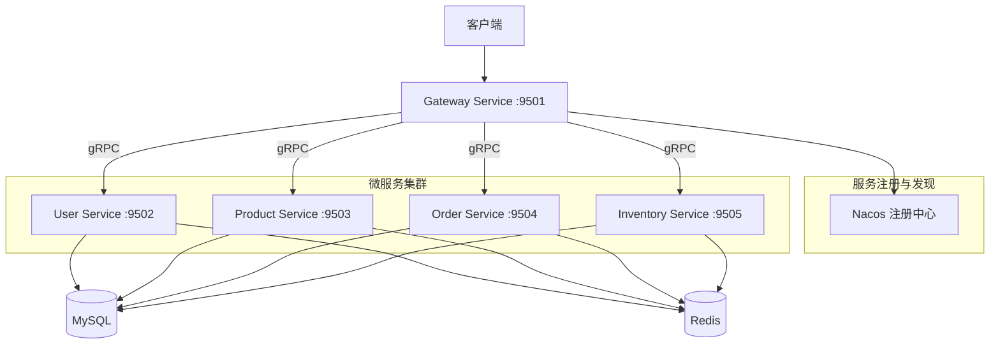

# 电商微服务系统设计文档

## 1. 系统架构



## 2. ER 图

```mermaid
erDiagram
    users {
        bigint id PK
        varchar username UK
        varchar password
        varchar email
        varchar phone
        tinyint status
        datetime created_at
        datetime updated_at
    }
    
    products {
        bigint id PK
        varchar name
        text description
        decimal price
        varchar image
        bigint category_id FK
        tinyint status
        datetime created_at
        datetime updated_at
    }
    
    categories {
        bigint id PK
        varchar name
        bigint parent_id
        int sort
        datetime created_at
    }
    
    orders {
        bigint id PK
        varchar order_no UK
        bigint user_id FK
        decimal total_amount
        tinyint status
        varchar address
        varchar receiver
        varchar phone
        datetime created_at
        datetime updated_at
    }
    
    order_items {
        bigint id PK
        bigint order_id FK
        bigint product_id FK
        int quantity
        decimal price
        datetime created_at
    }
    
    inventory {
        bigint id PK
        bigint product_id FK UK
        int stock
        int locked_stock
        datetime updated_at
    }
    
    users ||--o{ orders : "places"
    orders ||--|{ order_items : "contains"
    products ||--o{ order_items : "included_in"
    categories ||--o{ products : "has"
    products ||--|| inventory : "has"
```

## 3. 服务清单

| 服务名称 | 端口 | 职责 |
|---------|------|------|
| gateway-service | 9501 (HTTP) | API网关，路由转发，JWT验证 |
| user-service | 9502 (gRPC) | 用户注册、登录、信息管理 |
| product-service | 9503 (gRPC) | 商品管理、分类管理 |
| order-service | 9504 (gRPC) | 订单创建、查询、状态管理 |
| inventory-service | 9505 (gRPC) | 库存管理、库存锁定/释放 |

## 4. API 接口清单

### 4.1 用户服务 (User Service)

| 方法 | 路径 | 描述 |
|------|------|------|
| POST | /api/user/register | 用户注册 |
| POST | /api/user/login | 用户登录 |
| GET | /api/user/info | 获取用户信息 |
| PUT | /api/user/update | 更新用户信息 |

### 4.2 商品服务 (Product Service)

| 方法 | 路径 | 描述 |
|------|------|------|
| GET | /api/product/list | 商品列表 |
| GET | /api/product/detail/{id} | 商品详情 |
| POST | /api/product/create | 创建商品 |
| PUT | /api/product/update/{id} | 更新商品 |
| DELETE | /api/product/delete/{id} | 删除商品 |
| GET | /api/category/list | 分类列表 |

### 4.3 订单服务 (Order Service)

| 方法 | 路径 | 描述 |
|------|------|------|
| POST | /api/order/create | 创建订单 |
| GET | /api/order/list | 订单列表 |
| GET | /api/order/detail/{id} | 订单详情 |
| PUT | /api/order/cancel/{id} | 取消订单 |
| PUT | /api/order/pay/{id} | 支付订单 |

### 4.4 库存服务 (Inventory Service)

| 方法 | 路径 | 描述 |
|------|------|------|
| GET | /api/inventory/stock/{product_id} | 查询库存 |
| PUT | /api/inventory/update | 更新库存 |
| POST | /api/inventory/lock | 锁定库存 |
| POST | /api/inventory/unlock | 释放库存 |

## 5. 技术规范

### 5.1 通信协议
- 外部通信：HTTP/JSON (Gateway)
- 内部通信：gRPC/Protobuf

### 5.2 服务发现
- 注册中心：Nacos
- 负载均衡：Round Robin

### 5.3 认证方式
- JWT Token
- Token 有效期：24小时

### 5.4 日志规范
- 格式：JSON
- 级别：DEBUG/INFO/WARNING/ERROR
- 包含：request_id, service_name, timestamp
